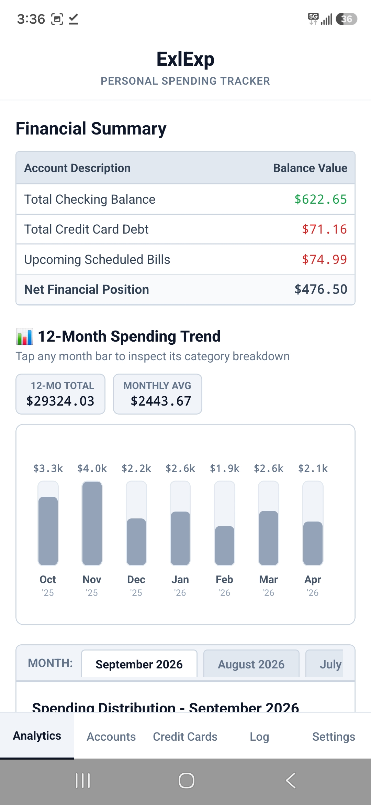
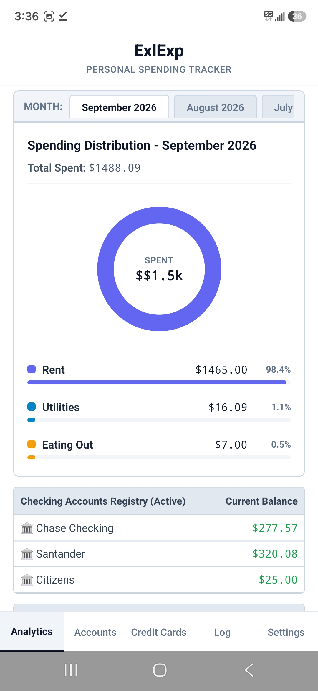
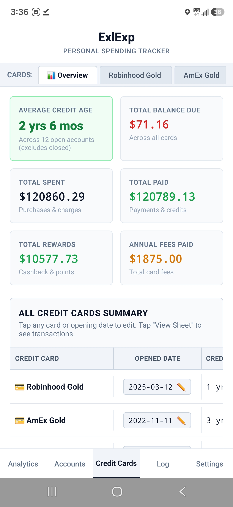
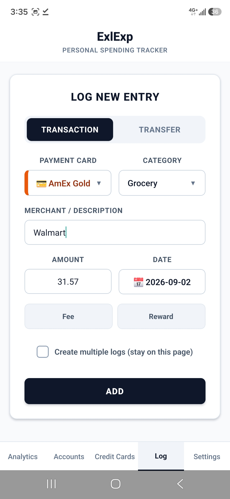
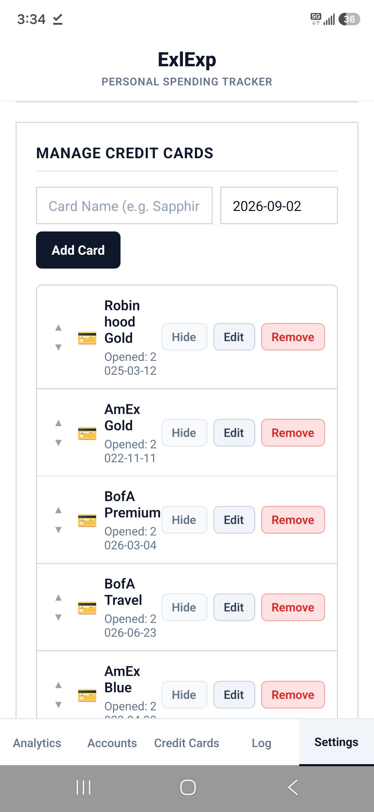

# ExlExp — Excel-Style Personal Expense Tracker

**ExlExp** is a simple, spreadsheet-inspired personal finance and expense tracking application built with **React Native (Expo)**, **TypeScript**, and **PostgreSQL / Supabase** backend. Designed for speed, precision, and clarity, ExlExp brings the simplicity and density of a financial spreadsheet to your web browser and mobile devices.

Live link: https://exlexp.vercel.app/

---

## Screenshots & Highlights

### 1. Financial Summary & 12-Month Spending Trend
Real-time net financial position calculation, balance totals, upcoming bills, and an interactive 12-month rolling spending bar chart with monthly averages.

<p align="center">
  
</p>

---

### 2. Spending Distribution & Account Registries
Category breakdown with an interactive SVG donut/wheel, percentage progress bars, and active account registries.

<p align="center">
  
</p>

---

### 3. Credit Cards Master Overview & Credit Age
Comprehensive credit card hub detailing opening dates, individual credit ages, average credit age (excluding closed cards), total spent, payments made, rewards, annual fees paid, and current balances due.

<p align="center">
  
</p>

---

### 4. Fast Expense & Transfer Logging
Unified logging engine supporting charges, credits, bank deposits, withdrawals, fees, rewards, Zelle transactions, and inter-account transfers.

<p align="center">
  
</p>

---

### 5. Settings & Account Customization
Manage all bank accounts (Checking, Savings, Brokerage) and Credit Cards. Easily add, rename, reorder, show/hide accounts, set opening dates, and manage user security.

<p align="center">
  
</p>

---

## Features

- ** Comprehensive Financial Summary**:
  - Net financial position calculated across all checking, savings, brokerage, and credit cards.
  - Upcoming scheduled bills tracking with quick-delete and total estimation.

- ** 12-Month Rolling Spending Trend**:
  - Interactive bar chart showing monthly spending history.
  - One-tap month selection to inspect category distributions.
  - 12-Month Total and Monthly Average KPI metrics.

- ** Spending Distribution Wheel**:
  - Color-coded category distribution donut chart.
  - Deterministic category color mapping for month-over-month consistency.
  - Progress bar breakdowns showing exact dollar amounts and percentage shares.

- ** Credit Card Management Hub**:
  - Individual credit ages and automated Average Credit Age calculation.
  - Total lifetime spent, payments made, reward points earned, and annual fees tracked.
  - Quick inline date editor for card opening dates.

- ** Checking, Savings & Brokerage Tracking**:
  - Dedicated account registries with real-time balance tracking.
  - Full transaction history with edit and delete capabilities.

- ** Streamlined Transaction Logging**:
  - Supports standard expenses, income/deposits, refunds, annual fees, and rewards.
  - Inter-account balance transfers and Zelle split-logging.
  - Mobile-friendly date picker and keyboard-avoiding controls.

- ** Security & User Management**:
  - Multi-user authentication support.
  - In-app username and password updates.

---

## 🛠️ Tech Stack

- **Frontend / Framework**: [React Native](https://reactnative.dev/) (v0.86) & [Expo](https://expo.dev/) (SDK 57)
- **Web Support**: [React Native for Web](https://necolas.github.io/react-native-web/)
- **Language**: [TypeScript](https://www.typescriptlang.org/)
- **Database & Backend**: [PostgreSQL](https://www.postgresql.org/) / [Supabase](https://supabase.com/) & Express.js server
- **Local Cache**: `@react-native-async-storage/async-storage`

---

## 🚀 Getting Started

### Prerequisites

- [Node.js](https://nodejs.org/) (v18 or higher recommended)
- [npm](https://www.npmjs.com/) or [yarn](https://yarnpkg.com/)
- [Expo Go](https://expo.dev/go) app (for physical mobile device testing) or an Android/iOS emulator

### Installation

1. **Clone the repository**:
   ```bash
   git clone https://github.com/your-username/ExlExp.git
   cd ExlExp
   ```

2. **Install dependencies**:
   ```bash
   npm install
   ```

3. **Configure Environment Variables**:
   Create a `.env` or set your Supabase database credentials in your configuration:
   ```env
   SUPABASE_URL=your_supabase_url
   SUPABASE_ANON_KEY=your_supabase_anon_key
   ```

### Running the App

- **Run on Web Browser**:
  ```bash
  npm run web
  ```

- **Run on Android**:
  ```bash
  npm run android
  ```

- **Run on iOS**:
  ```bash
  npm run ios
  ```

- **Start Expo Dev Server**:
  ```bash
  npm start
  ```

---

## 📄 License

This project is private and proprietary.
